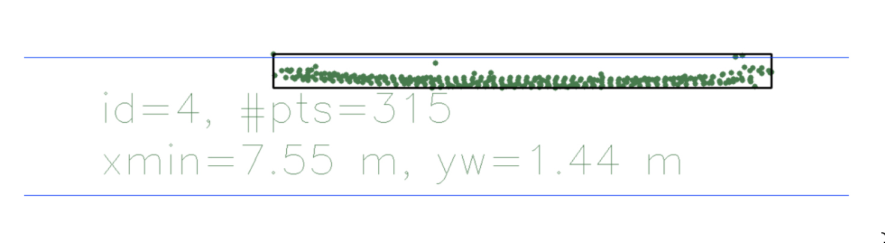
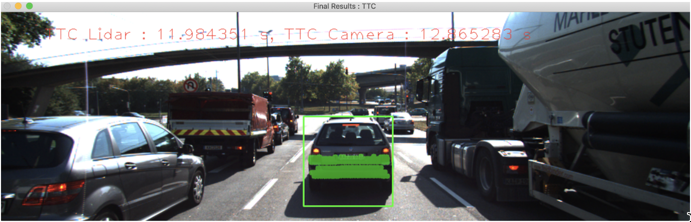
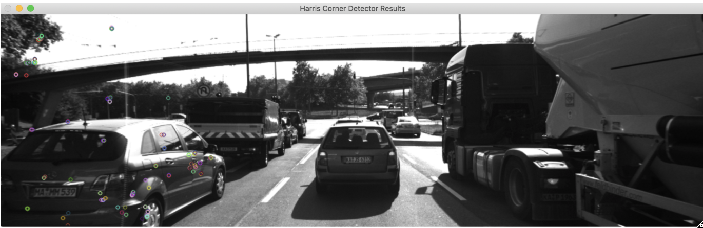

# Camera 3D Object Tracking

## Goal

The goal of the project is to use Lidar data and camera images to calculate the **Time to Collision** **(TTC)**.

*   Use keypoint detectors, descriptors, and methods to match them between successive images.
*   Detect objects in an image using the YOLO deep-learning framework. 
*   Associate regions in a camera image with Lidar points in 3D space
*   Find the displacement in Lidar points between successive images and use it to calculate the TTC.
*   Find the ratio of distance between the keypoints between successive images and use it to calculate the TTC.

## Performance Evaluation 1

### Lidar based TTC

**Lidar based TTC did not have any outliers**. It ranged from **11 - 16 sec**. The main reason for that is the use of **Median** distance in the cluster of the lidar points. It is a fair assumption that most of the lidar points would reside on the far back of the car (bumber, number plate, lights etc) and some points may lie on the road etc. Using the median value removed all the outliers.

## Performance Evaluation 2

### Camera Based TTC

In general the camera based TTC is not that reliable.

Examples of combination which yielded **good results** as compared to the lidar based TTC

*   SHITOMASI/BRISK
*   FAST/BRISK
*   SIFT/BRISK

**HARRIS** keypoint detector produced no results. Doing some investigation, it turns out that it was not able to detect any keypoints on the eagle car and therefore the rest of the logic did not work.

The image below shows the keypoints detected using HARRIS detector and how no keypoints are being detected on the eagle car.

**ORB** keypoint detector produced inconsistent results. Further investigations reveal that the bounding boxes matched across data-frames have not been consistent. Since the matching of bounding boxes is based on the matches of descriptors, it seems like the quality of matches is not that great with this detector/descriptor combination. Increasing the **confThreshold **to 0.3 helped it a little bit.

**SIFT/FREAK Combination**

An example run with the above combination yielded the following results. As seen the lidar based TTC is quite consistent while the camera based TTC is **quite unreliable**.

TTC Lidar : 12.614245 s, TTC Camera : 51.237297 s

TTC Lidar : 16.689386 s, TTC Camera : 133.545805 s

TTC Lidar : 15.908233 s, TTC Camera : 25.867109 s

TTC Lidar : 12.678716 s, TTC Camera : 22.082705 s

TTC Lidar : 11.984351 s, TTC Camera : 13.101959 s

TTC Lidar : 13.124118 s, TTC Camera : 17.848838 s

TTC Lidar : 13.024118 s, TTC Camera : -0.364537 s

TTC Lidar : 12.808601 s, TTC Camera : 13.833433 s

TTC Lidar : 8.959780 s, TTC Camera : 9.928531 s

## Basic Build Instructions

1. Clone this repo.
2. Make a build directory in the top level project directory: `mkdir build && cd build`
3. Compile: `cmake .. && make`
4. Run it: `./3D_object_tracking`.
